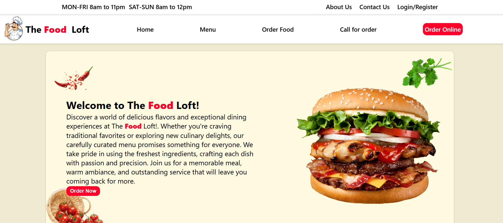

# THE FOOD LOFT 🧑‍🍳

A modern and responsive restaurant landing page built using **React** and **Material-UI**. The Food Loft showcases a professional design with a focus on user experience, making it ideal for promoting restaurant services and attracting customers.

## Preview 📸

## Features 🚀

- **Responsive Design**: Optimized for all devices, including desktops, tablets, and mobiles.
- **Modern UI Components**: Utilizes Material-UI components for a clean and elegant look.

- **Hero Section**: An attractive hero section with a restaurant introduction.
- **Menu Showcase**: A section to display featured dishes.
- **Testimonials**: Highlight customer reviews and experiences.
- **Contact Section**: Includes a contact form and location details.
- **Interactive Elements**: Buttons, animations, and hover effects to enhance user engagement.

## Technologies Used 📝
::
- **React.js**: For building the UI components and managing application state.
- **Material-UI**: For implementing modern and reusable UI components.
- **CSS**: Custom styles for additional design tweaks.